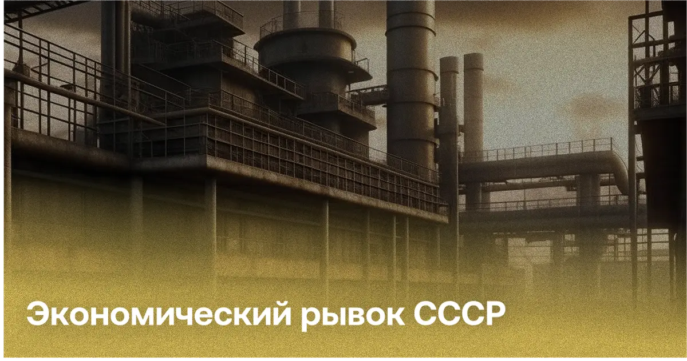
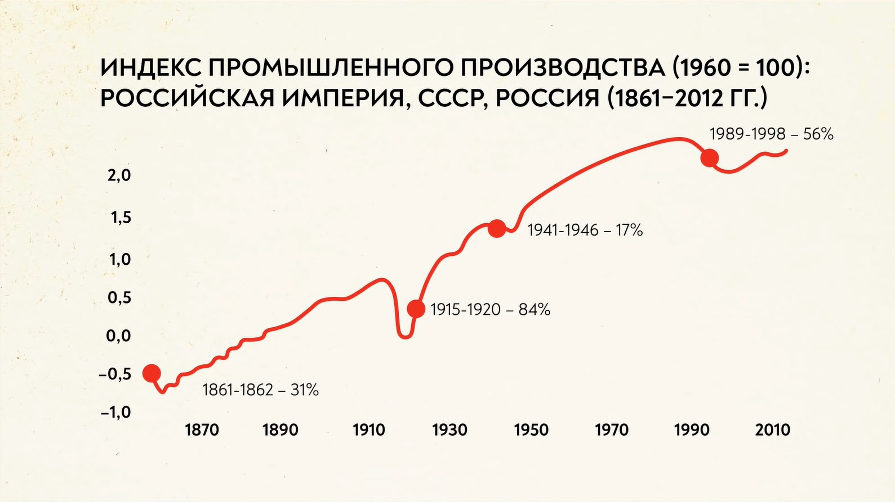
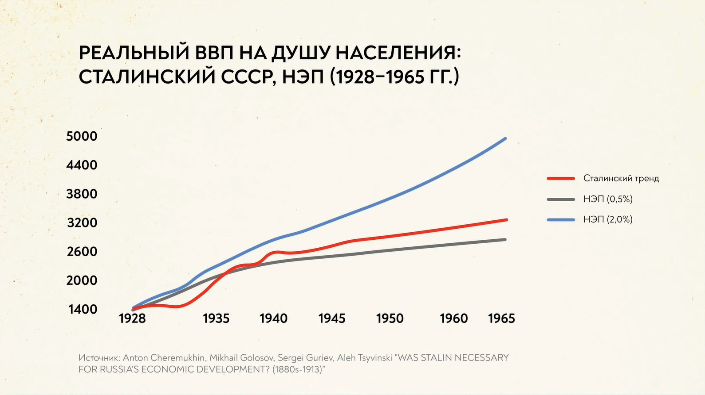
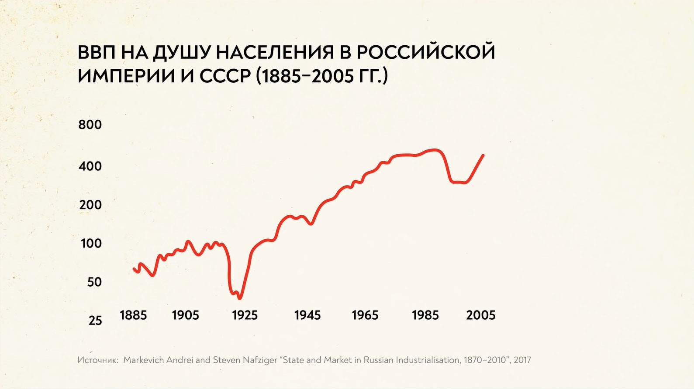

## Введение

### Актуальность темы

Актуальность данного исследования обусловлена необходимостью понимания научным сообществом инструментария, при помощи которого СССР осуществил технический рывок, какую роль он сыграл в восстановлении экономики, вышедшей на уровни Российской Империи в преддверии революции, а также провести исследование роли иностранного капитала и технологий на период 30-50 гг. в экономике и промышленности СССР.
### Объект и предмет исследования

Объект исследования — СССР.

Предмет исследования — проведение технического рывка в послереволюционной России.

### Цель исследования

Цель настоящей работы состоит в установлении причин технологического рывка СССР в 30-50 гг. XX в., а также установлении используемых при этом инструментов.

## Причины технологического рывка

Основанием проведения мер, способствовавших технологическому и экономическому подъему до уровней дореволюционной России послужило осознание правительством значительного отставания советской экономики от западных стран.

## Предисловие

Технологический прорыв связан с процессом индустриализации, реализованной в СССР в начале 20-го века. Индустриализацией является процесс ускоренного социально-экономического перехода от традиционной стадии развития к индустриальной, с преобладанием промышленного производства в экономике.

## Основная часть

В начале 1930-х годов руководством СССР во главе со Сталиным было принято решение о создании в стране мощной тяжелой промышленности в качестве основы социалистической экономики, военно-промышленного комплекса и топливно-энергетического хозяйства, развитии транспорта, особенно автомобильного и авиационного, и тракторостроения как технической базы коллективизации сел. Руководство страны исходило не только из того, что крупные, высокопроизводительные предприятия быстрее и полнее удовлетворяют потребности народного хозяйства, но и из того, что ими легче управлять из центра и с их помощью возможно ликвидировать пережитки традиционной многоукладной системы - массу мелких кустарных производств.

План первой пятилетки был реализован в 1928-1932 годах. В ходе его выполнения было развернуто большое количество строек - УралМаш, ЗИС и другие. Первую пятилетку удалось реализовать за четыре года и такой успех вдохновил рабочих. План предусматривал развитие электроэнергетики, и за 15 лет требовалось создать 30 электростанций.

Вторая пятилетка началась в 1933 году и закончилась в 1937 году. Люди трудились в три смены, ими руководило желание реализовать общую идею. За этот период изменилась модель индустриализации. Акцент теперь делался не на результатах, а на качестве. Стали известны такие личности, как Стаханов, Бусыгин, Чкалов и другие.

Третья пятилетка началась в 1938 году, но была прервана в 1941 году из-за начавшейся войны. Основной задачей этого этапа была необходимость догнать и перегнать страны Запада в производстве на душу населения. Это предполагалось достичь за счет сокращения расходов на военно-промышленный комплекс.

Развивающаяся высокими темпами и перестраивающая свою материально-техническую базу промышленность, изменила свою внутреннюю структуру на базе взрывного роста тяжелой индустрии и образования новых отраслей производства.

На этой основе была развернута социалистическая реконструкция, результатом которой стало создание современной передовой промышленности, реконструкция сельского хозяйства, завершение строительства основ социалистической экономики и, таким образом, обеспечение построения бесклассового социалистического общества при выполнении следующей пятилетки.

О величине той восстановительной роли, которую взяла на себя промышленность в народном хозяйстве СССР, свидетельствует, в частности, количество материальных ценностей, которые промышленность дала стране за годы пятилетки и которые она способна дать к концу пятилетки.

Металлургическая промышленность решала задачи обеспечения металлом машиностроительной отрасли. Удельный вес машиностроения и металлургии в потреблении металлопроката вырос с 47,9% в 1926/27 году до 68,1% в 1929/30 году и более 71% в 1931 и 1932 годах.

Роль промышленности в обеспечении страны передовой техникой особенно возросла. Промышленность оказала революционное влияние на всю структуру производства. Одновременно с этим из года в год растет способность промышленности поставлять тракторы сельскому хозяйству. К примеру, если за четыре с четвертью года сельское хозяйство получило более 153,9 тысячи тракторов, то только в 1932 году промышленность СССР дала 50 тысяч тракторов. Выпуск всей сельскохозяйственной техники в 1932 году был более чем в 5,5 раза выше, чем в 1927/28 году.
## Иностранный капитал

Решение этих вопросов с помощью Запада - в виде инвестиций (посредством предоставления концессий) или оплачиваемой технической помощи было единственным выходом. Спустя несколько лет после свертывания Новой экономической политики предоставление концессий прекратилось. В то время как импорт машин и оборудования продолжался, развивались другие отношения с западными фирмами, зародившиеся в период Новой экономической политики.

Попытки спроектировать и построить крупные, технически сложные предприятия не увенчались успехом. Первый советский проект Магнитогорского металлургического комбината, строительство Сталинградского и Челябинского тракторных заводов, Свирской ГЭС и т.д. потерпели неудачу. Главной причиной были директивы по увеличению размеров предприятий и срочному вводу их в эксплуатацию. Первый и второй пятилетние планы были направлены на создание новейших капиталоемких отраслей авиационной, автомобильной, тракторной, химической, машиностроительной, электротехнической и смежных отраслей промышленности, а также на размещение промышленности к востоку и югу от Урала, на отдаленных от границ территориях. К 1933 году необходимо было построить и реконструировать около 1 500 объектов.

Оказание технической помощи осуществлялось в рамках специальных соглашений или включалось в контракты на поставку оборудования. Они были намного короче концессий и более привлекательны для иностранных фирм, поскольку не требовали рискованных инвестиций. В период депрессии 1930-х годов западные компании испытывали повышенную потребность в крупных заказах, а СССР получал возможность за короткое время освоить передовые технологии и производственные навыки.

Днепровская ГЭС строилась по советскому проекту, но с привлечением американской компании Cooper Engineering и немецкой фирмы Siemens в качестве консультантов. Крупнейшие в Европе тракторные заводы, Сталинградский, Харьковский и Челябинский тракторные заводы, Магнитогорский металлургический комбинат и Нижегородский (Горьковский) автомобильный завод были построены по американскому типу и американского происхождения. Компании Albert Kahn, Inc., Ford Motor Company, International General Electric, International Harvester, Radio Corporation of America стали зарубежными партнерами Советского Союза.

По отечественным данным, в 1923-1933 годах в отраслях тяжелой промышленности СССР было заключено 170 договоров о технической помощи: 73 - с немецкими фирмами, 59 - с американскими, 11 - с французскими, 9 - со шведскими и 18 - с фирмами других стран. Определить, чья помощь была решающей, не представляется возможным, поскольку многие строительные проекты становились "международными". К примеру, объединение "Востокосталь" подписало договор с американской фирмой Arthur McKee на создание генерального плана Магнитогорского комбината, с немецкой фирмой Demag на проектирование его прокатного цеха, а другая немецкая фирма взяла на себя буровые работы для Магнитостроя. Всесоюзное химическое объединение "Всехимпром" имело 20 договоров с компаниями из США, Германии, Италии, Франции, Норвегии, Швеции, Швейцарии и др.

По различным причинам из 170 контрактов 37 были досрочно расторгнуты. Согласно советским оценкам, одни оказались слишком дорогими, другие - малопригодными, третьи - не укладывались в пятилетний график. В отдельных случаях производственная база оказалась недостаточной для использования новейшей технологии, или же ее успели освоить до истечения срока действия контракта. Увеличение объема выполняемых ArthurMcKee работ без дополнительной компенсации привело к расторжению контракта. Разногласия по финансовым и другим вопросам не позволили детройтской компании A.J. Brandt завершить техническую реконструкцию автомобильного завода АМО в Москве. Существует возможность выделить два обстоятельства, которые значительно сократили использование технической помощи после 1933 года. Во-первых, успех самой индустриализации. На множестве новых и реконструированных предприятий начался выпуск продукции, а некоторые и сами стали центрами распространения передовых технологий и обучения и обучения. Во вторых, огромные расходы, которые жестко контролировались Валютной комиссией Политбюро, влиявшей на все решения о закупках за рубежом.

## Альтернативная точка зрения

Если рассмотреть график долгосрочного развития российской экономики, то становится ясно, что сталинская индустриализация отнюдь не была прорывом. Фактический рост экономики в тридцатые годы укладывался в долгосрочные тенденции развития страны, и они были бы достигнуты Россией и без ужасов революции, коллективизации и труда узников ГУЛАГа.

В 2013 году группы экономистов опубликовала исследование, в соответствии с которым даже при самых неблагоприятных темпах развития НЭП имел бы успехи, схожие с результатами форсированной индустриализации. Выяснилось, что к началу 40-х годов страна пришла бы почти к такому же ВВП на душу населения, какой был в реальном Советском Союзе. А если бы рыночные реформы были расширены в конце 20-х годов, то ВВП на душу населения мог бы превысить сталинский показатель.

Для того чтобы добиться перераспределения рабочей силы из деревень в города, советское руководство не повышало уровень жизни в городах, а вело удушающую политику в деревнях. Это закончилось национальной катастрофой - голодом 32-33 годов, во время которого погибло 7 миллионов человек.

## Заключение

Руководство СССР после смерти Сталина находилось на распутье. В то время как реформы Маленкова были более либеральными, Хрущев модифицировал сталинский курс.

Был резко увеличен объем инвестиций: на 1956-1959 годы были запланированы государственные инвестиции в размере 990 млрд рублей, таким образом, инвестиции в советскую экономику за эти три года превысили весь предыдущий пятилетний план, разработанный при Сталине. Кроме того, началась реформа управления: введение совнархозов.

Резюмируя описанное выше, ставится понятным, какие инструменты использовались во время создания промышленного и экономического рывка в СССР в начале XX века, а также понять эффективность отдельных компонентов этой большой цепи.
## Литература

1. Cheremukhin, Anton and Golosov, Mikhail and Guriev, Sergei and Tsyvinski, Aleh and Tsyvinski, Aleh, Was Stalin Necessary for Russia's Economic Development? (September 2013). NBER Working Paper No. w19425, Available at SSRN: https://ssrn.com/abstract=2325798

2. Gregory, Paul R. Russian National Income, 1885-1913. Cambridge Univ.Press, 1982. 3. Markevich Andrey, Harrison Mark. Great War, Civil War, and Recovery: Russia's National Income, 1913 to 1928.The Journal of Economic History, Vol.71, No.3 (September 2011). ( https://www.nes.ru/files/Preprints-resh/WP146.pdf )

4. Borodkin,Gregory, "Russia’s Industrial Growth In the First Stage of Industrialisation (1880s-1913)" ( https://archive.org/details/borodkin_gregory/page/n9/mode/2up )

5. Alexander Gerschenkron (1947). Supplement: Economic Growth: A Symposium || The Rate of Growth in Russia: The Rate of Industrial Growth in Russia, Since 1885. The Journal of Economic History, 7(), 144–174.

6. Markevich Andrei. State and Market in Russian Industrialization, 1870–2010

7. Лекция РЭШ: https://youtu.be/PczQgFV3C2w

8. Корчагина Софья Ильинична, Черепухина Василиса Сергеевна, Чернявская Екатерина Николаевна СОЦИАЛЬНО-ЭКОНОМИЧЕСКОЕ РАЗВИТИЕ СССР В 1920 - 1930 ГОДЫ ХХ ВЕКА (дата обращения: 13.12.2022).
