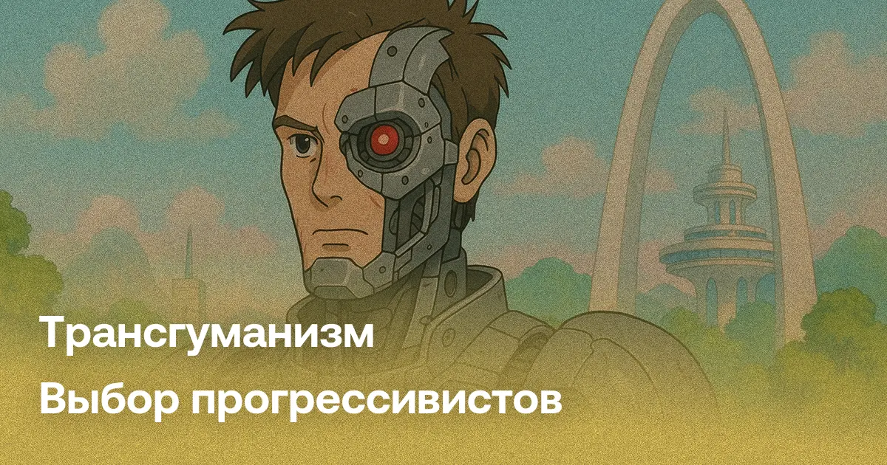
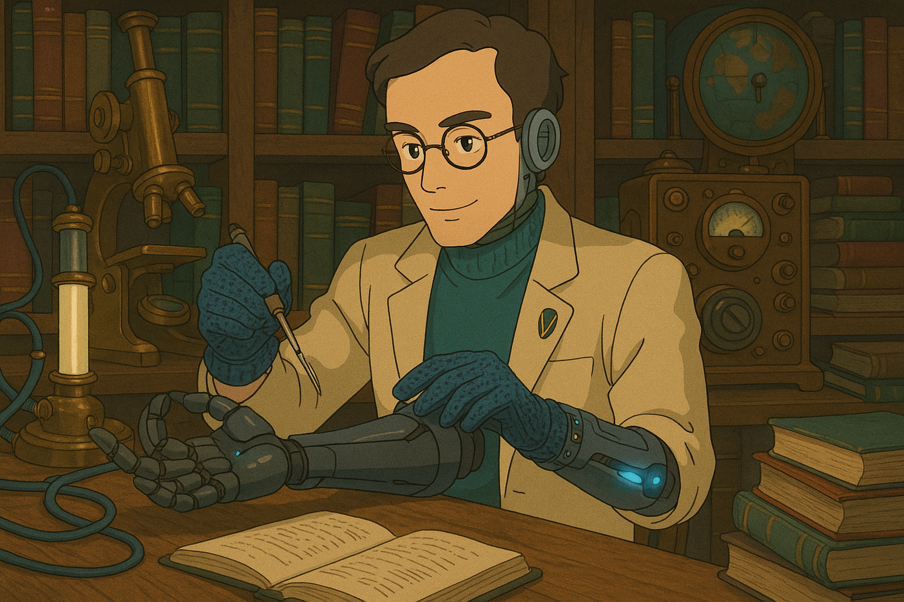
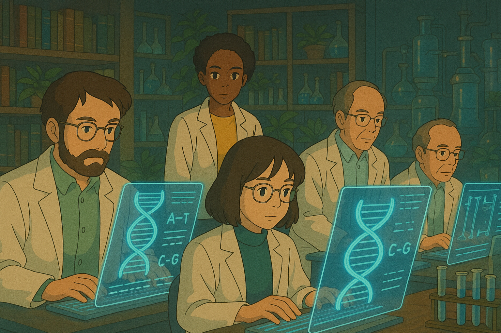
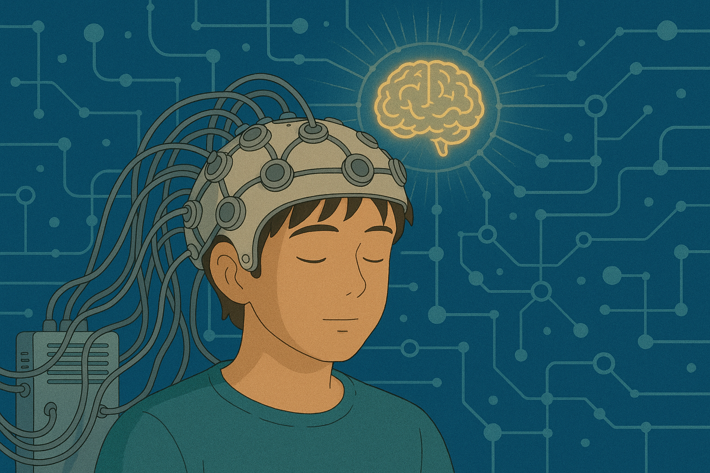
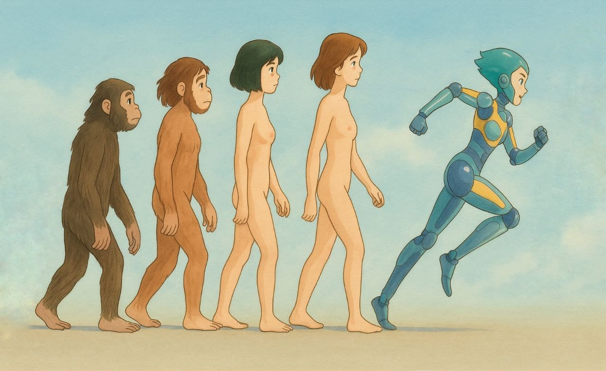
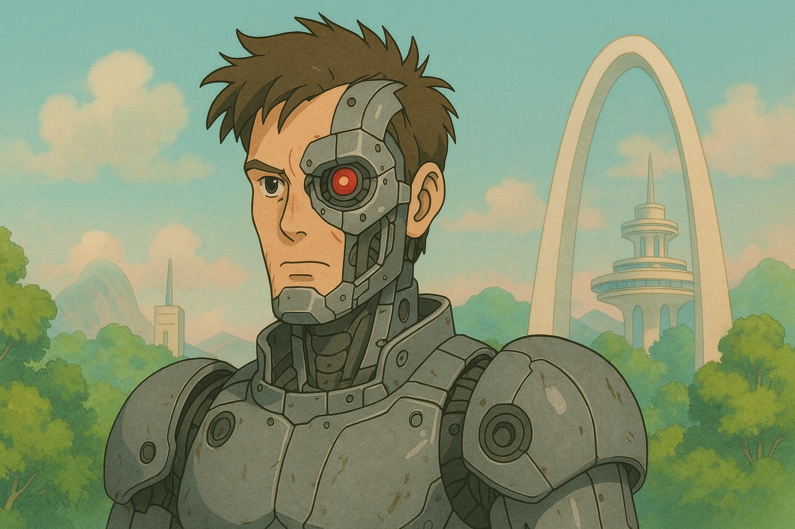

## Введение

Трансгуманизм — это философское и научное движение, выступающее за радикальное улучшение человека с помощью передовых технологий.

От генной инженерии до нейроинтерфейсов, трансгуманисты верят, что наука способна преодолеть биологические ограничения, такие как старение, болезни и даже смертность. Зародившись в XX веке, эта концепция набирает популярность в эпоху стремительного развития искусственного интеллекта и биотехнологий. Сегодня трансгуманизм вызывает как восторг, так и ожесточённые споры: одни видят в нём путь к утопии, другие — угрозу человеческой сущности.

Эта статья исследует ключевые идеи трансгуманизма и его технологические перспективы. Готово ли человечество шагнуть за пределы своей природы?
## Основные идеи трансгуманизма

### Улучшение человека через технологии

Трансгуманизм начинается с главного посыла: человек — не предел. Мы не обязаны оставаться такими, какими нас создала природа. Если возможно быть умнее, здоровее, сильнее — почему бы не стать? Современные технологии становятся продолжением нашей эволюции, только теперь мы сами берём управление в свои руки.

Одним из ключевых направлений этого прогресса становится киборгизация — внедрение технологических устройств прямо в тело человека. Импланты уже сегодня позволяют восстанавливать слух, зрение, управлять протезами силой мысли и мониторить состояние организма в реальном времени. В будущем нейроинтерфейсы, искусственные органы и усиленные сенсоры станут не исключением, а нормой, расширяя границы наших возможностей так же естественно, как когда-то это сделали очки или смартфоны.

В будущем нас ждёт глубокая интеграция с технологиями: нейроинтерфейсы, искусственные органы, сенсоры, усиливающие восприятие. Человек-киборг перестаёт быть фантастикой — это следующий логичный шаг. Мы больше не просто приспосабливаемся к окружающему миру — мы трансформируем себя, чтобы выйти за границы биологического существования.

Этих взглядов придерживаются трансгуманисты-киборги, которые стремятся усиливать тело и разум с помощью технологий уже сегодня.

### Преодоление биологических ограничений

Старение, болезни, смерть — долгие века человек воспринимал их как неотвратимую участь. Но трансгуманизм бросает вызов самой идее конечности. Почему мы должны мириться с деградацией тела? Почему смерть — норма, а не техническая ошибка эволюции?

Здесь вступает в игру иммортилизм — мировоззрение, утверждающее, что смерть не неизбежна. Это не философская метафора, а практическая цель: продление жизни вплоть до бессмертия. Иммортилисты убеждены, что если старение — это болезнь, значит, её можно вылечить. А если смерть — это сбой, значит, его можно обойти.

Сегодня наука уже ищет способы остановить клеточное старение, очистить организм от накопившегося молекулярного мусора, перезапустить механизмы регенерации. CRISPR (clustered regularly-interspaced short palindromic repeats) позволяет редактировать гены, не просто лечить болезни, а предотвращать их ещё до рождения. Персонализированная медицина, клеточная терапия, нанороботы в крови — это не фантазия, а первые шаги к радикальному продлению жизни.

Для трансгуманистов конечность биологического тела — не приговор, а вызов. И чем мощнее становятся технологии, тем ближе человечество подходит к моменту, когда умирать по старинке станет не нормой, а осознанным выбором.

Эти идеи развивают трансгуманисты-иммортилисты, считающие бессмертие реальной научной целью.

### Концепция сингулярности и искусственный интеллект

Технологическая сингулярность — это не угроза, а долгожданный скачок в развитии разума. Это момент, когда искусственный интеллект обретёт способность к самосовершенствованию и поможет нам решать задачи, которые сегодня кажутся невозможными. Вместо страха — надежда: сингулярность открывает перед человечеством двери в новую эпоху процветания, знаний и беспрецедентных возможностей.

ИИ уже помогает нам находить лекарства, управлять сложными системами, прогнозировать климат и автоматизировать рутину. Но это только начало. В будущем искусственный интеллект станет нашим партнёром в мышлении, в творчестве, в научных открытиях. Он не заменит человека — он усилит нас, станет продолжением нашей воли, нашего разума, нашей мечты о лучшем мире.

Для трансгуманистов сингулярность — это путь к выходу за пределы ограничений. Это шанс объединить биологический и машинный интеллект, преодолеть болезни, смерть, невежество. Мы стоим на пороге великого объединения человеческого стремления к знанию и точности машинной логики. И если мы будем достаточно смелыми и мудрыми, это будущее станет самым светлым за всю историю человечества.

Эти взгляды разделяют трансгуманисты-сингуляристы, сосредоточенные на развитии искусственного интеллекта и нейроинтеграции

## Технологии трансгуманизма

Изучив ключевые идеи и направления трансгуманизма, мы можем перейти к рассмотрению технологий, которые он продвигает и считает фундаментальными для будущего человека:

- **Искусственный интеллект (ИИ)** — одна из ключевых технологий будущего. Начало использования инструментов стало катализатором человеческой эволюции, приведя к созданию машин и автоматизации труда. Сегодня ИИ совершает аналогичную революцию в области умственного труда. Уже сейчас Narrow AI (узкоспециализированный ИИ) обрабатывает колоссальные массивы данных, принимает решения и даже создаёт произведения искусства. В будущем развитие General AI (AGI, искусственный общий интеллект), а затем и ASI (искусственный сверхинтеллект), может привести к появлению разума, значительно превосходящего человеческий. ИИ будет не только служить человеку, но и станет его партнёром, наставником, другом, а возможно, и частью его личности через нейроинтерфейсы и когнитивные импланты.

- **Роботы** обеспечивают внедрение ИИ в физический мир. С развитием сенсорики, автономной навигации и тактильной обратной связи роботы будут выполнять всё более широкий спектр задач: от ухода за пожилыми людьми до колонизации космоса. От крошечных MEMS (микроэлектромеханических систем) до автономных дронов и роботизированных производственных комплексов — они станут повсеместными. Их количество, как ожидается, превзойдёт популяцию людей и животных.

- **Киборги** — результат слияния человека с машинами. Уже сегодня бионические протезы восстанавливают утраченные функции, а экзоскелеты усиливают физические возможности. В будущем будут массово применяться нейроинтерфейсы (например, Neuralink), имплантаты для улучшения памяти и внимания, сетчаточные протезы, а также «умные» органы, подключенные к интернету вещей (IoT). Появится феномен «аугментированных людей» — людей с расширенными когнитивными и сенсорными возможностями.

- **Генная инженерия** — ключ к контролю над биологической природой. С помощью CRISPR-Cas9, Prime Editing, и TALEN возможно точечно редактировать ДНК, исправляя генетические мутации и усиливая желаемые черты. Уже сегодня генная терапия лечит редкие заболевания, а в будущем мы сможем увеличивать интеллект, выносливость и устойчивость к вирусам. Геномное программирование будущего сделает доступным создание «дизайнерских детей» и направленную эволюцию.

- **Продление жизни** становится задачей биотехнологий, привлекающей внимание крупнейших корпораций и институтов. Используются теломеразные активаторы, senolytics — препараты для удаления «зомби-клеток», редактирование эпигенома, технология NAD+ реставрации и даже омоложение клеток с помощью Yamanaka-факторов. Клеточная терапия, органоидные технологии и 3D-печать органов на подходе к реальной борьбе со старением.

- **Бессмертие** — цель, которую трансгуманисты ставят перед наукой. Уже сегодня мы знаем, что старение — не обязательный биологический процесс, а поддающийся инженерии. Повреждения можно лечить, органы заменять, а тело восстанавливать с помощью наномедицины. Возможность «биологического бессмертия» становится всё более реалистичной — как через радикальное продление жизни, так и через цифровые формы существования.

- **Крионика** — это ставка на будущее. Сохраняя тела и мозг в состоянии анабиоза при помощи витрификации, сторонники крионики рассчитывают на то, что будущие технологии (например, наномедицина и молекулярная регенерация) смогут вернуть человека к жизни, не просто оживив тело, но и восстановив его сознание.

- **Нанотехнологии** откроют абсолютный контроль над материей. С помощью молекулярных сборщиков (assembler) можно будет создавать любые объекты с атомарной точностью. В медицине это приведёт к созданию наноботов, способных ремонтировать клетки, убивать раковые опухоли и очищать сосуды. В промышленности — к сверхэффективным и дешевым производствам.

- **Экономика изобилия** станет возможной благодаря автоматизации, нанотехнологиям и ИИ. Принципы post-scarcity экономики подразумевают устранение дефицита и снижение стоимости до нуля. Будут переосмыслены концепции труда, собственности и распределения. Появятся децентрализованные автоматические системы управления ресурсами (DAO), которые заменят традиционные рынки и государства.

- **Когнитивная наука** сделает человека хозяином своего сознания. Исследования в области нейропластичности, optogenetics, трансмагнитной стимуляции (TMS) и BCI (brain-computer interface) позволят модифицировать мышление, ускорять обучение, устранять психические расстройства и усиливать интеллект. Появятся персонализированные нейропрофили, позволяющие точно настраивать ментальное состояние под конкретные задачи.

- **Парадайз-инжиниринг** — это проект радикального счастья. Дэвид Пирс и его последователи предлагают уничтожить страдание на биологическом уровне. Используя геноинженерию, психофармакологию, нейромодуляцию и ИИ, человечество может избавиться от боли, страха, депрессии и создать стабильное состояние благополучия — не временное, а базовое.

- **Загрузка сознания (mind uploading)** откроет возможность перехода к нематериальной форме существования. Это может происходить путём сканирования и эмуляции мозга (Whole Brain Emulation), а также через синтетическую реконструкцию сознания. Загрузка откроет путь к цифровому бессмертию, клонированию разума, коллективным метасознаниям и сверхинтеллекту, объединяющему миллиарды индивидуальных личностей.

- **Сингулярность** — это предсказанный момент, когда темпы технологического прогресса достигнут такой скорости и масштабов, что человеческий интеллект перестанет быть доминирующей формой разума на планете. По прогнозу Рэя Курцвела, сингулярность наступит тогда, когда искусственный интеллект достигнет уровня общего интеллекта (AGI), а затем превзойдёт человеческий, сформировав сверхразум (ASI). Этот переломный момент приведёт к экспоненциальному саморазвитию технологий, в первую очередь ИИ, который начнёт проектировать собственные улучшенные версии. С этого момента прогресс станет автономным и практически непредсказуемым для человеческого сознания. Сингулярность ознаменует начало постчеловеческой эры, в которой исчезнут границы между человеком, машиной и информацией. Биологические пределы будут преодолены с помощью загрузки сознания, интерфейсов мозг-компьютер, нанотехнологий и полного контроля над материей. Люди смогут существовать в цифровой форме, объединяться в мысленные коллективы и создавать виртуальные реальности, превосходящие по сложности всё, что существовало прежде. Этот этап станет не просто технологическим скачком, а переходом к новому типу эволюции — направляемой, осознанной, бесконечной.

Ступень эволюции содержащая пост-человека.

Все эти технологии — не фантазия, а зарождающаяся реальность. Они формируют архитектуру будущего, в котором человек перестанет быть пассивным продуктом эволюции и станет её архитектором.

## Будущее через трансгуманизм

Будущее, в которое ведёт трансгуманизм, — это не просто продолжение истории человечества. Это её радикальный перелом. На горизонте — сценарии, в которых привычный человек исчезает, уступая место существу, обладающему практически безграничными возможностями. Мы смотрим в сторону сингулярности — точки, где скорость научного и технологического развития выходит за пределы понимания, а искусственный интеллект становится мощнее всей совокупной человеческой мысли. Вслед за ней — постчеловеческое общество, в котором разум перестаёт быть привязан к телу, информация течёт напрямую между сознаниями, а страдание и смерть отходят в прошлое.

В этом будущем особенно важен вопрос: кто управляет прогрессом? Трансгуманизм по своей сути близок к либертарианским ценностям — свободе выбора, недопустимости насильственного вмешательства в тело и сознание, праву на технологическое самоопределение. Государство здесь не должно быть директивным архитектором будущего, но и не может оставаться сторонним наблюдателем. Оно должно снимать запреты на исследование и применение трансгуманистических практик — от генной терапии до крионики и нейроимплантов.

Но трансгуманизм не гарантирует рай. Возможны и антиутопические сценарии — где доступ к бессмертию контролирует элита, а неравенство возрастает до космических масштабов. Где государство использует нейротехнологии для контроля над мышлением, а генная инженерия закрепляет касты. Эта грань между утопией и антиутопией — тонкая. Именно поэтому сегодня важно этическое сопровождение научного прогресса и открытый общественный диалог о будущем.

Космос — естественное продолжение трансгуманистической повестки. Колонизация других планет невозможна без трансформации самого человека. Нам предстоит адаптация к марсианской гравитации, радиации, дефициту ресурсов. Решения — в генной модификации, имплантах, экзоскелетах и цифровых интерфейсах. Трансгуманизм делает возможным внеземную экспансию: к звёздам отправятся не просто люди, а обновлённые постлюди, способные к выживанию в самых экстремальных условиях.

По всему миру уже сегодня формируются инициативы и организации, строящие фундамент будущего. Среди них — Humanity+, Фонд бессмертия, Neuralink, OpenAI, Фонд Сингулярности, Lifespan.io, Methuselah Foundation. Они проводят исследования, финансируют прорывные проекты, лоббируют легализацию трансгуманистических практик. Их деятельность — доказательство того, что будущее создаётся уже сейчас, и каждый может стать его участником.

Трансгуманизм — это не утопия, не религия и не мода. Это стратегия выживания и развития человечества в XXI веке и далее. Нам предстоит решить: станем ли мы кибернетическими бессмертными мудрецами, путешествующими по галактикам, или закроем дверь в это будущее из страха перед переменами.

## Заключение

Трансгуманизм предлагает человечеству путь радикального преображения — через технологии, знания и волю к прогрессу. Это философия, соединяющая научный прорыв с вечной мечтой: преодолеть болезни, старение и даже смерть. Но вместе с возможностями приходят и серьёзные вызовы: этика вмешательства в природу человека, сохранение личной и культурной идентичности.

Как говорил Рей Курцвел: «Технологии — это расширение нашего разума и тела. Они делают нас более человечными, а не менее». Именно от нашего выбора зависит, станет ли этот путь дорогой к светлому будущему или источником новых конфликтов. Уже сегодня необходимо открыто обсуждать, каким мы хотим видеть завтрашний мир.

Фракция Трансгуманистов Либертарианской партии России уже готовит обращение в Государственную Думу с инициативой об отмене антитрансгуманистичных законов, препятствующих развитию прорывных биомедицинских и цифровых технологий. Мы уверены: будущее нужно не ждать, а строить — смело, осознанно и свободно.
